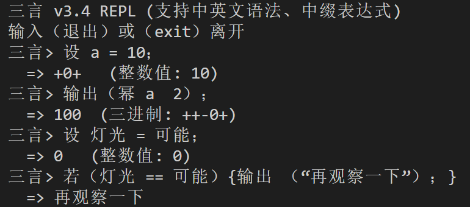

# 三言 Sanyan v3.4

> 三言不是一门工业级编程语言。它是一个基于中文和三进制逻辑的思维实验。它不能替代Python，也不能跑在树莓派上。它能给你的，是为'不确定'保留一种合法状态的勇气。



---

## 起源

1958 年，莫斯科国立大学造了一台三进制计算机，叫 **Setun**。每个比特不是 0 或 1，而是**正、零、负**。它稳定运行了三十年，功耗只有同期二进制计算机的三分之一。然后被停产了——不是因为技术不行，而是苏联的工业标准全面转向了二进制。

2024 年，我在用 ESP32 做智能家居时，发现所有传感器都在对我说三种状态：有人、没人、信号不稳。但我的代码只能写 `if` 和 `else`。"信号不稳"被强行归类为 0 或 1，然后我加了一堆阈值、状态机和注释来弥补丢失的信息。

**如果编程语言原生支持第三种状态呢？**
于是就有了三言。

---

## 为什么不一样

| | 其他中文编程语言 | 三言 |
|---|---|---|
| **计算模型** | 二进制 | 平衡三进制（+1, 0, -1） |
| **第三态** | 用 null/NaN 模拟 | `可能` 是第一等计算状态 |
| **中文支持** | 翻译英文关键字 | 中文语义层直接映射三态（开/关/守） |
| **IoT 控制** | 需手动实现 | 内置传感器/执行器抽象 |
| **语法** | 单一 | 类 C 糖语法 + Lisp 风格 S 表达式 |

**`可能` 不是模糊逻辑，不是空值**。它可以参与算术和逻辑运算，与 `真`、`假` 平起平坐。

---

## 快速开始

```bash
git clone https://github.com/shujingyin510/sanyan.git
cd sanyan
python main.py
```

进入 REPL 后尝试：

```text
三言> 设 a = 10;
三言> 输出(a ^ 2);
  => 100  (三进制: ++-0+)
```

运行示例文件：

```bash
python main.py examples/greenhouse.san
```

### 杀手级示例：智能温室控制系统

以下代码模拟了一个温室环境，光线和人体传感器返回三态信号（真/假/可能），温度传感器返回连续值。系统根据三态决策控制灯光、窗帘、风扇和加热器，并在传感器冲突时执行优先级处理。

```c
// 智能温室控制系统 greenhouse.san
加载("stdlib/iot.san")
加载("stdlib/math.san")
加载("stdlib/string.san")

定义 记录 (消息) {
    设 当前日志 = ""
    尝试 {
        当前日志 = 读文件("greenhouse.log")
    } 捕获 (错误) {
        当前日志 = ""
    }
    设 新日志 = 连接(当前日志, "\n", 消息)
    写文件("greenhouse.log", 新日志)
    输出(消息)
}

定义 转光线描述 (值) {
    若 (值 == 真) { 返回("充足") }
    再若 (值 == 假) { 返回("不足") }
    否则 { 返回("不稳") }
}

定义 转人体描述 (值) {
    若 (值 == 真) { 返回("有人") }
    再若 (值 == 假) { 返回("无人") }
    否则 { 返回("不确定") }
}

定义 转温度描述 (温度) {
    若 (温度 >= 29) { 返回("炎热") }
    再若 (温度 >= 28) { 返回("温暖") }
    再若 (温度 >= 15) { 返回("适宜") }
    再若 (温度 >= 10) { 返回("偏冷") }
    否则 { 返回("寒冷") }
}

定义 温室控制 () {
    记录("温室系统启动（随机传感器模拟，共检测10次）。")

    设 运行次数 = 0
    设 总次数 = 10

    循环 (运行次数 < 总次数) {
        设 光线值 = 随机态()
        设 温度值 = 随机数(10, 35)
        置 人体 = 随机态()

        设 光线描述 = 转光线描述(光线值)
        设 温度描述 = 转温度描述(温度值)
        设 人体值 = 读 人体
        设 人体描述 = 转人体描述(人体值)

        记录("----------------------------------------")
        记录(连接("【检测 ", 运行次数 + 1, "/", 总次数, "】光线: ", 光线描述, "，温度: ", 温度值, "（", 温度描述, "），人体: ", 人体描述))

        若 (光线值 == 真) {
            置 灯 = 灭
            置 窗帘 = 开
            记录("光照充足，补光灯关闭，窗帘拉开。")
        } 再若 (光线值 == 假) {
            置 灯 = 亮
            置 窗帘 = 关
            记录("光照不足，补光灯开启，窗帘关闭。")
        } 否则 {
            置 灯 = 守
            置 窗帘 = 守
            记录("光照不稳定，保持当前状态。")
        }

        设 常温上限 = 28
        设 常温下限 = 15

        若 (温度值 > 常温上限) {
            置 风扇 = 开
            置 加热 = 关
            记录("高温，风扇启动，加热关闭。")
        } 再若 (温度值 < 常温下限) {
            置 风扇 = 关
            置 加热 = 开
            记录("低温，加热启动，风扇关闭。")
        } 否则 {
            置 风扇 = 守
            置 加热 = 守
            记录("温度正常，设备待机。")
        }

        设 检测结果 = 检测并动作()
        若 (检测结果 == 真) {
            记录("人体检测：有人，灯已设为亮（覆盖光线决策）。")
        } 再若 (检测结果 == 假) {
            记录("人体检测：无人，灯已关闭（覆盖光线决策）。")
        } 否则 {
            记录("人体检测：不确定，灯保持当前状态（不受影响）。")
        }

        运行次数 = 运行次数 + 1
        等待(1)
    }

    记录("========== 温室监控结束 ==========")
    记录(连接("共执行 ", 总次数, " 次检测。"))
    查 灯
    查 窗帘
    查 风扇
    查 加热
    0
}

温室控制()
```

某次运行输出片段（所有传感器状态均为随机，每次结果不同）：

```text
温室系统启动（随机传感器模拟，共检测10次）。
----------------------------------------
【检测 1/10】光线: 充足，温度: 22（适宜），人体: 不确定
光照充足，补光灯关闭，窗帘拉开。
温度正常，设备待机。
人体检测：不确定，灯保持当前状态（不受影响）。
----------------------------------------
【检测 2/10】光线: 不稳，温度: 30（炎热），人体: 有人
光照不稳定，保持当前状态。
高温，风扇启动，加热关闭。
人体检测：有人，灯已设为亮（覆盖光线决策）。
----------------------------------------
...
========== 温室监控结束 ==========
共执行 10 次检测。
  灯 当前状态: 守 (0)
  窗帘 当前状态: 开 (+)
  风扇 当前状态: 关 (-)
  加热 当前状态: 关 (-)
```

这个示例直观展示了三言的核心价值：**不确定状态 `守` 作为一等公民参与决策**，无需用"阈值+默认值"的二进制技巧来模拟。

---

## 三言长什么样

### 糖语法（类 C，日常使用）

```c
// 智能家居：晚安模式
定义 晚安 () {
    置 灯 = 灭;
    置 窗帘 = 关;
    置 风扇 = 守;    // 风扇保持当前状态，不强制关闭
    输出("晚安");
}

// 遍历传感器，只在确定时动作
遍历 i 从 1 到 5 {
    若 (读 人体 == 真) {
        置 灯 = 亮;
    } 再若 (读 人体 == 可能) {
        置 灯 = 守;   // 不确定有没有人，保持待机
    } 否则 {
        置 灯 = 灭;
    }
}
```

### 原生 S 表达式（底层等价形式，适合元编程）

```lisp
（定义 晚安 （）
  （做
    （置 灯.灭）
    （置 窗帘.关）
    （置 风扇.守）
    （输出 "晚安"）））

（遍历 i 1 5
  （若 （读 人体）
      （置 灯.亮）
      （若 （可能） （置 灯.守） （置 灯.灭））））
```

两种语法共享同一个求值器，可以混用。

---

## 三进制不是模拟

三言的三进制不是"用二进制模拟三进制"。`ternary_core.py` 从位运算层开始就是三值的：

```text
平衡三进制加法：
  +0-  (十进制 2)
+  0+  (十进制 3)
------
  +--  (十进制 5) ✓
```

三值逻辑（Kleene 强逻辑）：

| A | B | A 且 B | A 或 B |
|---|---|--------|--------|
| 真 | 可能 | 可能 | 真 |
| 假 | 可能 | 假 | 可能 |
| 可能 | 可能 | 可能 | 可能 |

**可能 且 可能 还是可能**。不确定的事情叠加不确定的事情，结果仍然不确定。

---

## 特性一览

| 特性 | 示例 |
| --- | --- |
| 变量与赋值 | `设 x = 42;` |
| 三态词 | `开/关/守`, `真/假/可能`, `是/否/待` |
| 条件分支 | `若 (x > 10) { ... } 否则 { ... }` |
| 循环 | `循环 (i < 10) { ... }` |
| 遍历 | `遍历 i 从 1 到 100 { ... }` |
| 函数定义 | `定义 平方 (x) { x * x; }` |
| 匿名函数 | `函数(x) { x + 1; }` 或 `λ(x) { x + 1; }` |
| 高阶函数 | 映射、过滤、归并 |
| 容器 | 列表、数组（定长）、字典 |
| 三态逻辑 | `且`、`或`、`非`，三值真值表 |
| IoT 控制 | `置 灯 = 亮;`、`查 灯;`、`对 灯 { ... }` |
| 模块加载 | `加载("utils.san");` |
| 数学函数 | 绝对值、平方根、最大值、最小值、随机数 |
| 字符串 | `连接("你好", "世界")`，原文块 `原文{任意内容}` |
| 调试 | `调试()` 打印变量和传感器状态 |
| 异常处理 | `尝试 { ... } 捕获 (错误) { ... }` |
| 返回 | `返回(值);` |
| 文件操作 | `读文件("路径")`、`写文件("路径", "内容")` |
| 时间与等待 | `当前时间()`、`等待(秒)` |
| 类型判断 | `是数字(值)`、`是字符串(值)`、`字符串相等(a,b)` |

---

## 项目结构

```text
sanyan/
├── main.py            # 入口
├── ternary_core.py    # 平衡三进制核心（BT、ALU、TritValue、ArrayValue）
├── runtime.py         # 运行环境（变量、传感器、执行器、BUILTIN_OPS 真源）
├── builtins_ops.py    # 内置操作实现（含 FunctionValue、高阶函数）
├── commands.py        # 自定义命令
├── evaluator.py       # 字典分发的求值器
├── lexer.py           # S 表达式词法分析
├── parser.py          # S 表达式语法分析
├── sugar.py           # 糖语法转换器（类 C → S 表达式）
├── repl.py            # REPL 交互环境
├── examples/          # 示例程序
│   └── greenhouse.san # 杀手级示例：智能温室控制系统
├── stdlib/            # 标准库（math, string, list, iot, io）
└── docs/              # 语言手册
```

---

## 三态词表

三言内置了一组中文语义词，直接映射三进制值：

| 语义 | 三进制值 | 整数值 |
| --- | --- | --- |
| 开 / 真 / 亮 / 有 / 是 | `+` | 1 |
| 守 / 可能 / 待 / 未知 | `0` | 0 |
| 关 / 假 / 灭 / 无 / 否 | `-` | -1 |

这些不是关键字别名，是语言的语义层。`守` 表示"保持当前状态"，`可能` 表示"尚未确定"，`待` 表示"等待输入"。在 IoT 场景下，这些区别有实际意义。

---

## 路线图

- [x] 平衡三进制算术与三值逻辑
- [x] 自定义命令与匿名函数
- [x] 高阶函数（映射/过滤/归并）
- [x] 列表、数组、字典容器
- [x] IoT 传感器/执行器抽象
- [x] 类 C 糖语法 + S 表达式双语法
- [x] `返回` 关键字，函数提前退出
- [x] 模块命名空间隔离
- [x] 异常处理 `尝试` / `捕获`
- [x] 文件读写原语
- [ ] 字符串插值 `模板{...}`
- [ ] 三态专有分支 `判`
- [ ] GPIO 真实硬件控制
- [ ] Web IDE
- [ ] 标准库扩展（字符串、排序、时间）

---

## 为什么是中文

中文天然适合表达三进制。

英文只有 "on / off"，中文有 "开 / 关 / 守"。
英文只有 "true / false"，中文有 "真 / 假 / 可能"。

"可能" 由"可"和"能"两个独立语素组成——"可不可以"和"能不能"是两个维度，它们的张力产生了第三态。这是中文造词法特有的能力。

三言没有"翻译"任何语言。它的中文关键字直接生长在三值逻辑之上。

---

## 三进制最有价值的地方

不是万能钥匙，但恰好能打开最重要的门：

- **传感器冲突（智能家居）**：不确定时不动作，而非强行判定
- **用户犹豫（智能穿戴 / VR）**：`可能` 是自然交互状态
- **AI 推理加速（NPU/GPU）**：乘法变加减，零值跳过
- **脑机接口**：大脑信号永远不确定
- **游戏 NPC**：NPC 天然需要犹豫

**不适用**：火灾报警、加密、网络协议等需要绝对确定性的场合。

---

## For English Readers (TL;DR)

**Sanyan** is a Chinese programming language based on balanced ternary logic (+, 0, -).

Unlike most "Chinese programming languages" that merely translate English keywords, Sanyan leverages the fact that Chinese semantics naturally support ternary thinking: words like `守` (hold/keep), `可能` (maybe/uncertain), and `待` (await) carry nuanced third-state meanings that have no direct equivalent in English.

It runs on Python. It has:

- Native ternary arithmetic (not simulated)
- Kleene strong logic (true AND maybe = maybe)
- C-like sugar syntax + Lisp-style S-expressions
- Higher-order functions (map, filter, reduce)
- Built-in IoT sensor/actuator abstraction

Quick start:

```bash
git clone https://github.com/shujingyin510/sanyan.git
cd sanyan
python main.py
```

**Philosophy**: uncertainty is not a bug — it's a legitimate computational state.

---

## License

MIT (c) 2025
